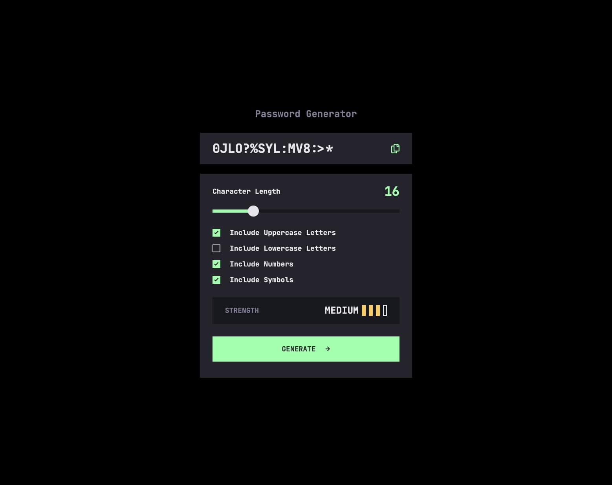

# Frontend Mentor - Password generator app solution

This is a solution to the [Password generator app challenge on Frontend Mentor](https://www.frontendmentor.io/challenges/password-generator-app-Mr8CLycqjh). Frontend Mentor challenges help you improve your coding skills by building realistic projects.

## Table of contents

- [Overview](#overview)
  - [The challenge](#the-challenge)
  - [Screenshot](#screenshot)
  - [Links](#links)
- [My process](#my-process)
  - [Built with](#built-with)
  - [What I learned](#what-i-learned)
- [Author](#author)

**Note: Delete this note and update the table of contents based on what sections you keep.**

## Overview

### The challenge

Users should be able to:

- Generate a password based on the selected inclusion options
- Copy the generated password to the computer's clipboard
- See a strength rating for their generated password
- View the optimal layout for the interface depending on their device's screen size
- See hover and focus states for all interactive elements on the page

### Screenshot

### Links

- Github URL: [https://www.frontendmentor.io/solutions/password-generator-app-built-with-reacttypescript-and-tailwind-WnOhWoucsv](https://www.frontendmentor.io/solutions/password-generator-app-built-with-reacttypescript-and-tailwind-WnOhWoucsv)
- Live Site URL: [https://password-generator-virid-six-62.vercel.app/](https://password-generator-virid-six-62.vercel.app/)

## My process

### Built with

- React
- TypeScript
- Tailwind
- Zustand

### What I learned

This is a pretty simple app, but I chose something simple this time around because I wanted to focus on architecture, reusability, and performance. I kept my components pretty clean - for the most part they just return JSX. I put most of my logic in custom hooks or utilities where necessary. I was also conscious of rendering and minimizing re-renders - which involved memoization and using Zustand for state management. I also wanted to be sure to meet accessibility standards so this was further practice with that.

## Author

- Website - [JHDev Studio](https://jhughessuta.github.io/)
- Frontend Mentor - [@JHughesSUTA](https://www.frontendmentor.io/profile/yourusername)
